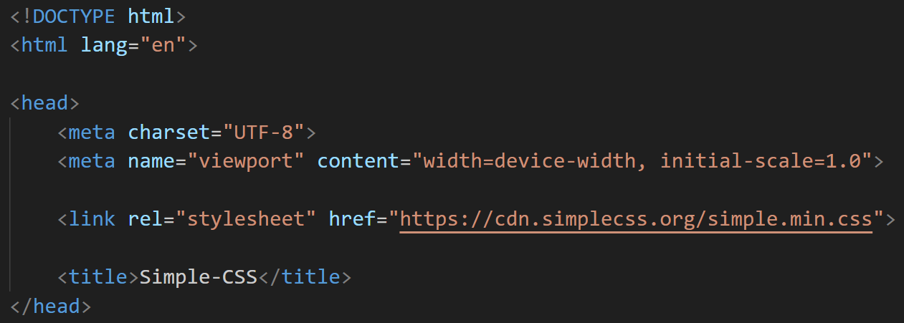

# Tugbaaay-simple-css
Sadece HTML etiketlerini kullanarak basit bir site oluşturdum.

Simple css kullanmak, çok kısa bir süre içinde (5-10 dk) hiç bir css bilgisi olmadan nasıl bir site oluşturulabileceğine güzel bir örnek.

Simple css kullanmak için HTML sayfalarının `<head><head>` etiketlerinin arasına `<link rel="stylesheet" href="https://cdn.simplecss.org/simple.min.css">`bu kodu eklemeniz yeterli olacaktır.

Projenin Canlı Hali:<a href="https://tugba-simple-css-demo.netlify.app"> Buradan Ulaşabilirsiniz</a>

Simple Css Web Sitesi:<a href="https://simplecss.org/"> Buradan Ulaşabilirsiniz</a>

